# Traffic Flow & Port Mapping - Infrastructure Overview

> **Last Updated**: January 5, 2026  
> **Purpose**: Tài liệu tổng hợp flow từ bên ngoài (Internet) vào application qua các thành phần infrastructure và ports tương ứng

---

## 📊 Executive Summary

Khi một user truy cập application từ Internet, request đi qua **8 layers** với **node groups** là infrastructure layer quan trọng:

```
Internet → DNS → [WAF] → ALB → [SG] → [Node Group] → Ingress → Service → Pod
(443)    (53)   (443)   (443)  (checks) (t3.large×2) (80/3000) (80/3000) (80/3000)
```

**Infrastructure Components:**
- **Node Group**: 2× t3.large EC2 instances (2 vCPU, 8GB RAM each)
- **Auto-Scaling**: Min 2, Desired 2, Max 4 nodes
- **Networking**: AWS VPC CNI for pod-to-pod communication
- **Max Pods per Node**: 17 pods (ENI limitation for t3.large)

**Total latency estimation:**
- DNS: ~10-50ms
- WAF: ~5-10ms  
- ALB: ~10-20ms
- Node Network: ~1-2ms (iptables + CNI)
- K8s Ingress: ~1-5ms
- Service routing: ~1ms
- Pod processing: varies by app

**Quick Navigation:**
- [📈 Sequence Diagrams](#-sequence-diagrams) - Visual flow với Mermaid diagrams (11 diagrams)
- [🌐 ASCII Diagram](#-complete-traffic-flow-diagram-ascii) - Text-based architecture
- [📋 Port Summary](#-port-summary-table) - Port mapping table
- [🔐 Security Groups](#-security-group-rules-detail) - Firewall rules
- [🚨 Troubleshooting](#-common-issues--troubleshooting) - Debug guide

---

## 📈 Sequence Diagrams

### Diagram 1: Successful Homepage Request

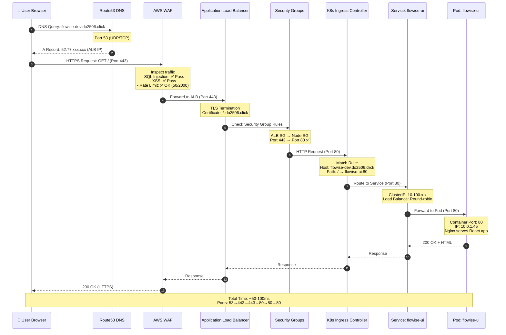

---

### Diagram 2: Successful API Request

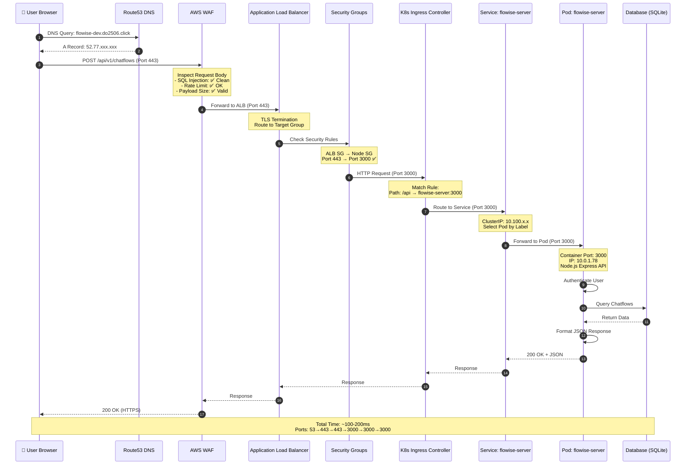

---

### Diagram 3: WAF Blocks Malicious Request

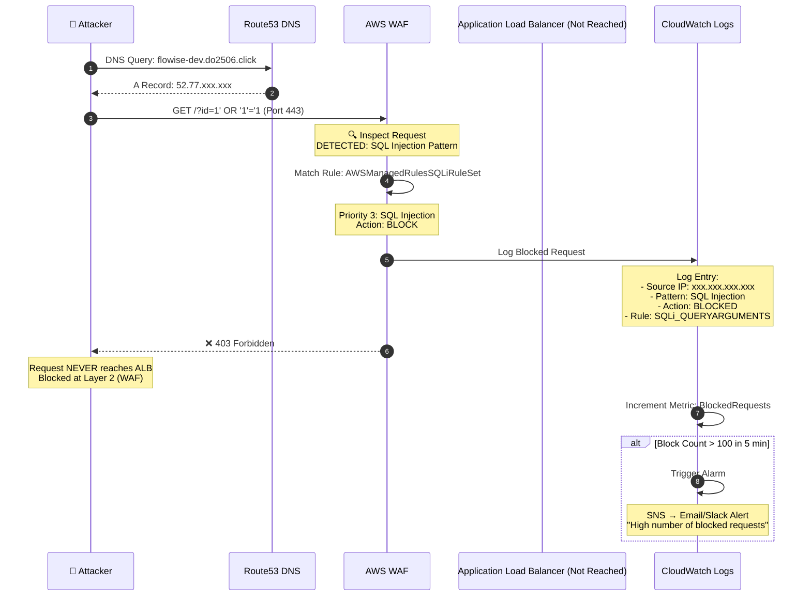

---

### Diagram 4: Health Check Flow

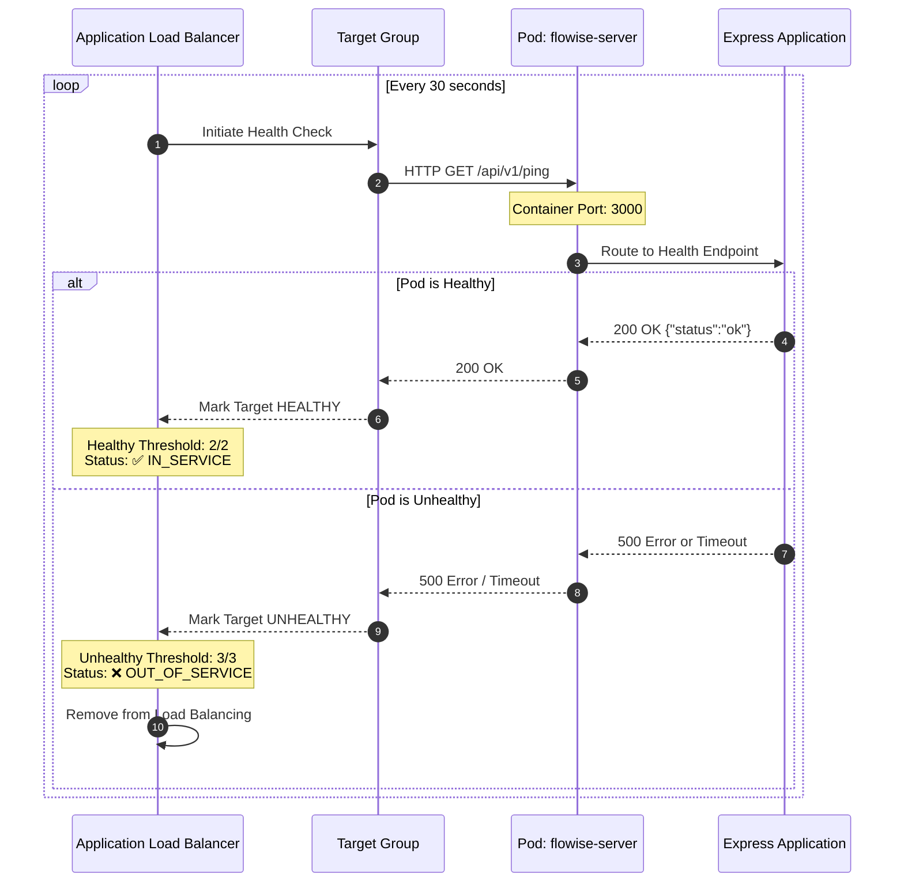

---

### Diagram 5: Complete Request Flow with Node Groups

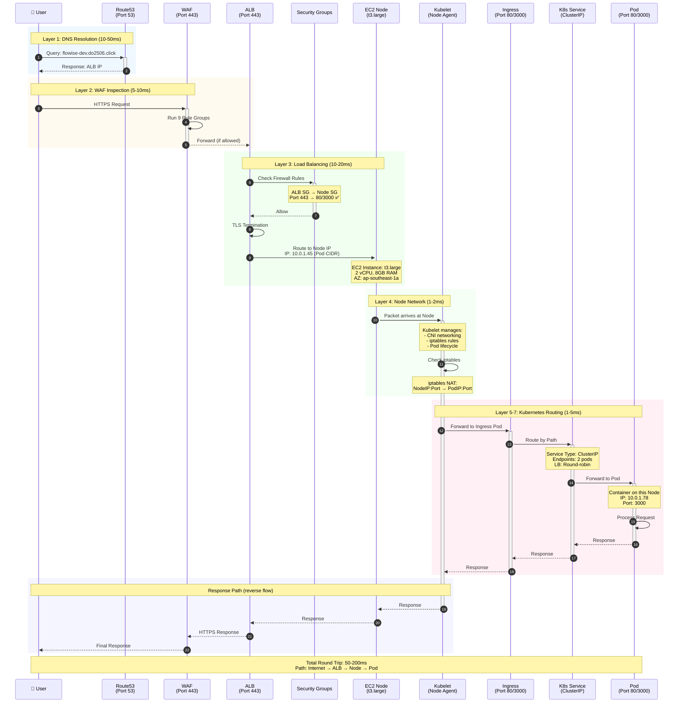

---

### Diagram 6: Node Group Auto-Scaling & Health

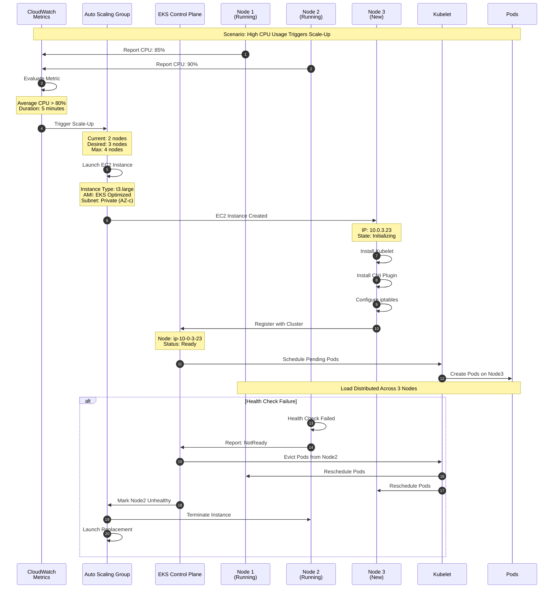

---

### Diagram 7: Node-to-Node Communication (Cross-Node Pods)

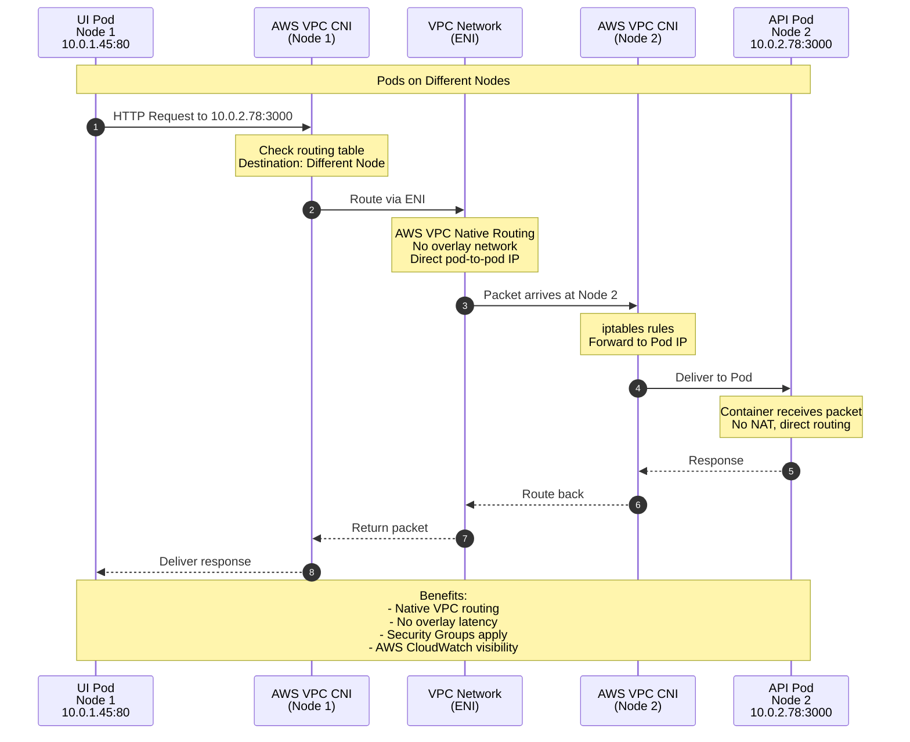

---

### Diagram 8: Multi-Path Request Decision Flow

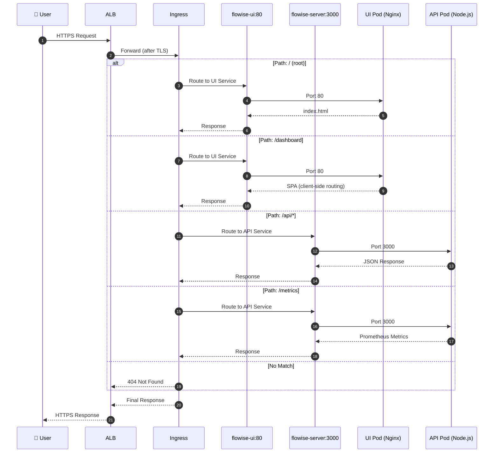

---

### Diagram 9: Error Scenarios

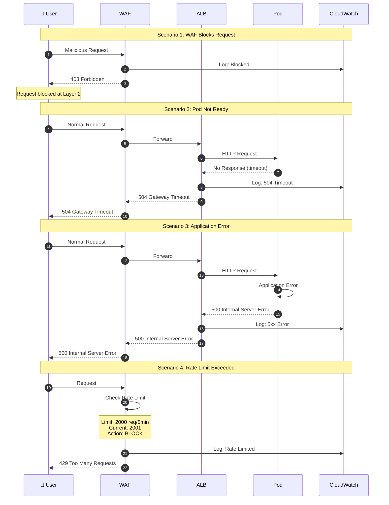

---

### Diagram 10: Pod to Pod Communication (Same Node)

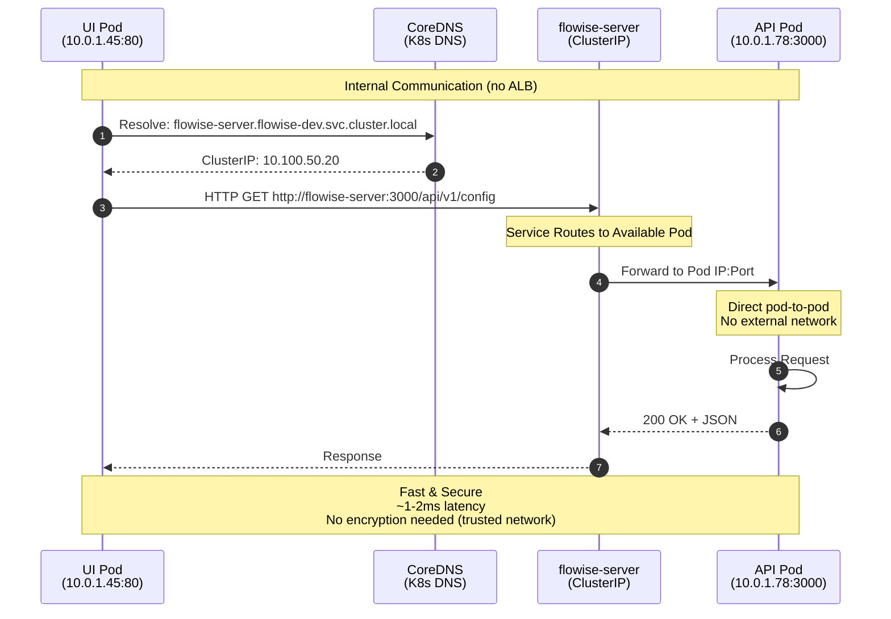

---

### Diagram 11: ArgoCD Deployment Flow (GitOps)

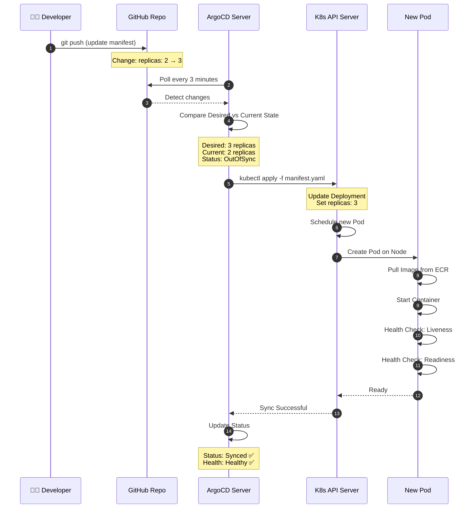

---

## 🌐 Complete Traffic Flow Diagram (ASCII)

```
┌─────────────────────────────────────────────────────────────────────────┐
│                         INTERNET (Public)                               │
│                                                                         │
│  User Browser: https://flowise-dev.do2506.click                        │
│                                                                         │
│  Port: 443 (HTTPS)                                                      │
└───────────────────────────────┬─────────────────────────────────────────┘
                                │
                                │ TLS 1.2/1.3
                                │ (Encrypted)
                                ▼
┌─────────────────────────────────────────────────────────────────────────┐
│  LAYER 1: DNS RESOLUTION                                                │
│  ━━━━━━━━━━━━━━━━━━━━━━━━━━━━━━━━━━━━━━━━━━━━━━━━━━━━━━━━━━━━━━━━━━━━  │
│                                                                         │
│  Component: Amazon Route53                                              │
│  Port: 53 (DNS)                                                         │
│  Protocol: DNS over UDP/TCP                                             │
│                                                                         │
│  Records:                                                               │
│  - flowise-dev.do2506.click → A record → ALB Public IP                  │
│  - flowise-staging.do2506.click → A record → ALB Public IP              │
│  - flowise-prod.do2506.click → A record → ALB Public IP                 │
│  - argocd.do2506.click → A record → ALB Public IP                       │
│  - prometheus.do2506.click → A record → ALB Public IP                   │
│  - grafana.do2506.click → A record → ALB Public IP                      │
│                                                                         │
│  TTL: 300 seconds (5 minutes)                                           │
└───────────────────────────────┬─────────────────────────────────────────┘
                                │
                                │ Returns: ALB DNS/IP
                                │
                                ▼
┌─────────────────────────────────────────────────────────────────────────┐
│  LAYER 2: WEB APPLICATION FIREWALL (WAF)                                │
│  ━━━━━━━━━━━━━━━━━━━━━━━━━━━━━━━━━━━━━━━━━━━━━━━━━━━━━━━━━━━━━━━━━━━━  │
│                                                                         │
│  Component: AWS WAF v2 (Regional)                                       │
│  Port: 443 (Inspects HTTPS traffic)                                     │
│  Scope: REGIONAL (attached to ALB)                                      │
│                                                                         │
│  ┌───────────────────────────────────────────────────────────┐         │
│  │  INSPECTION RULES (executed in priority order)            │         │
│  ├───────────────────────────────────────────────────────────┤         │
│  │  Priority 1: AWS Managed Rules - Core Rule Set           │         │
│  │              └─ SQL Injection                             │         │
│  │              └─ XSS (Cross-Site Scripting)                │         │
│  │              └─ LFI (Local File Inclusion)                │         │
│  │              └─ RFI (Remote File Inclusion)               │         │
│  │                                                           │         │
│  │  Priority 2: Known Bad Inputs                             │         │
│  │              └─ Known malicious patterns                  │         │
│  │              └─ Exploits database                         │         │
│  │                                                           │         │
│  │  Priority 3: SQL Database Protection (conditional)        │         │
│  │              └─ Advanced SQL injection patterns           │         │
│  │                                                           │         │
│  │  Priority 4: Linux OS Protection (conditional)            │         │
│  │              └─ Linux command injection                   │         │
│  │              └─ Shellshock attacks                        │         │
│  │                                                           │         │
│  │  Priority 5: Rate Limiting                                │         │
│  │              └─ Limit: 2000 requests per 5 minutes        │         │
│  │              └─ Per IP address tracking                   │         │
│  │              └─ Action: BLOCK excess requests             │         │
│  │                                                           │         │
│  │  Priority 6: Geo Blocking (conditional)                   │         │
│  │              └─ Block specific countries                  │         │
│  │              └─ Allow list: VN, US, SG, etc.              │         │
│  │                                                           │         │
│  │  Priority 7: IP Blacklist (conditional)                   │         │
│  │              └─ Manually blocked IPs                      │         │
│  │              └─ Known attack sources                      │         │
│  │                                                           │         │
│  │  Priority 8: IP Whitelist (conditional)                   │         │
│  │              └─ Only allow specific IPs                   │         │
│  │              └─ Corporate networks, VPN, etc.             │         │
│  │                                                           │         │
│  │  Priority 9: Custom Regex Pattern (conditional)           │         │
│  │              └─ Custom attack patterns                    │         │
│  │              └─ Business-specific validation              │         │
│  └───────────────────────────────────────────────────────────┘         │
│                                                                         │
│  Logging: CloudWatch Logs                                               │
│  Log Group: /aws/waf/my-eks-dev-dev-waf                                 │
│  Retention: 30 days                                                     │
│                                                                         │
│  Metrics:                                                               │
│  - BlockedRequests                                                      │
│  - AllowedRequests                                                      │
│  - CountedRequests                                                      │
│                                                                         │
│  Alarms:                                                                │
│  - Blocked requests > 100 in 5 min → Alert                              │
│  - Rate limit hits > 50 in 5 min → Alert                                │
└───────────────────────────────┬─────────────────────────────────────────┘
                                │
                                │ ✅ ALLOWED (clean traffic)
                                │ ❌ BLOCKED (malicious/rate-limited)
                                │
                                ▼
┌─────────────────────────────────────────────────────────────────────────┐
│  LAYER 3: APPLICATION LOAD BALANCER (ALB)                               │
│  ━━━━━━━━━━━━━━━━━━━━━━━━━━━━━━━━━━━━━━━━━━━━━━━━━━━━━━━━━━━━━━━━━━━━  │
│                                                                         │
│  Component: AWS ALB (flowise-dev-alb)                                   │
│  Type: internet-facing                                                  │
│  Scheme: Internet-facing                                                │
│  VPC: Public subnets (2 AZs)                                            │
│                                                                         │
│  ┌───────────────────────────────────────────────────────────┐         │
│  │  LISTENERS                                                 │         │
│  ├───────────────────────────────────────────────────────────┤         │
│  │                                                           │         │
│  │  Listener 1: HTTP → Port 80                               │         │
│  │  ─────────────────────────                                │         │
│  │  Protocol: HTTP                                           │         │
│  │  Action: REDIRECT to HTTPS (443)                          │         │
│  │  Status: 301 Moved Permanently                            │         │
│  │                                                           │         │
│  │  Listener 2: HTTPS → Port 443                             │         │
│  │  ──────────────────────────                               │         │
│  │  Protocol: HTTPS                                          │         │
│  │  Certificate: ACM (*.do2506.click)                        │         │
│  │  SSL Policy: ELBSecurityPolicy-TLS-1-2-2017-01           │         │
│  │                                                           │         │
│  │  Rules:                                                   │         │
│  │  ┌─────────────────────────────────────────┐             │         │
│  │  │ Host: flowise-dev.do2506.click          │             │         │
│  │  ├─────────────────────────────────────────┤             │         │
│  │  │ Path: /api/*                            │             │         │
│  │  │ → Target Group: flowise-server          │             │         │
│  │  │ → Port: 3000                            │             │         │
│  │  │ → Health: /api/v1/ping                  │             │         │
│  │  │                                         │             │         │
│  │  │ Path: /*                                │             │         │
│  │  │ → Target Group: flowise-ui              │             │         │
│  │  │ → Port: 80                              │             │         │
│  │  │ → Health: /                             │             │         │
│  │  └─────────────────────────────────────────┘             │         │
│  └───────────────────────────────────────────────────────────┘         │
│                                                                         │
│  Target Type: IP (direct to pod IPs)                                    │
│  Health Checks:                                                         │
│  - Interval: 30 seconds                                                 │
│  - Timeout: 5 seconds                                                   │
│  - Healthy threshold: 2 consecutive successes                           │
│  - Unhealthy threshold: 3 consecutive failures                          │
│                                                                         │
│  Cross-Zone Load Balancing: Enabled                                     │
│  Deletion Protection: Disabled (dev), Enabled (prod)                    │
│                                                                         │
│  Tags:                                                                  │
│  - Environment: dev                                                     │
│  - Application: flowise                                                 │
│  - ManagedBy: kubernetes-alb-controller                                 │
└───────────────────────────────┬─────────────────────────────────────────┘
                                │
                                │ Routes to Target Groups
                                │ Port: 80 (UI) or 3000 (API)
                                │
                                ▼
┌─────────────────────────────────────────────────────────────────────────┐
│  LAYER 4: SECURITY GROUPS                                               │
│  ━━━━━━━━━━━━━━━━━━━━━━━━━━━━━━━━━━━━━━━━━━━━━━━━━━━━━━━━━━━━━━━━━━━━  │
│                                                                         │
│  ┌─────────────────────────────────────────────────────────┐           │
│  │  ALB SECURITY GROUP (sg-alb-xxx)                        │           │
│  ├─────────────────────────────────────────────────────────┤           │
│  │  Inbound Rules:                                         │           │
│  │  - Port 80 (HTTP) from 0.0.0.0/0                        │           │
│  │  - Port 443 (HTTPS) from 0.0.0.0/0                      │           │
│  │                                                         │           │
│  │  Outbound Rules:                                        │           │
│  │  - Port 80 to Node SG (for UI pods)                     │           │
│  │  - Port 3000 to Node SG (for Server pods)               │           │
│  └─────────────────────────────────────────────────────────┘           │
│                     │                                                   │
│                     │ Allows traffic                                    │
│                     ▼                                                   │
│  ┌─────────────────────────────────────────────────────────┐           │
│  │  EKS NODE SECURITY GROUP (sg-node-xxx)                  │           │
│  ├─────────────────────────────────────────────────────────┤           │
│  │  Inbound Rules:                                         │           │
│  │  - Port 80 from ALB SG (UI traffic)                     │           │
│  │  - Port 3000 from ALB SG (API traffic)                  │           │
│  │  - Port 443 from Cluster SG (K8s API)                   │           │
│  │  - Port 1025-65535 from Cluster SG (kubelet)            │           │
│  │  - All traffic from Node SG (inter-node)                │           │
│  │  - Port 22 from Bastion (optional SSH)                  │           │
│  │                                                         │           │
│  │  Outbound Rules:                                        │           │
│  │  - All traffic to 0.0.0.0/0 (egress)                    │           │
│  └─────────────────────────────────────────────────────────┘           │
│                     │                                                   │
│                     │                                                   │
│                     ▼                                                   │
│  ┌─────────────────────────────────────────────────────────┐           │
│  │  EKS CLUSTER SECURITY GROUP (sg-cluster-xxx)            │           │
│  ├─────────────────────────────────────────────────────────┤           │
│  │  Inbound Rules:                                         │           │
│  │  - Port 443 from Node SG (pods → API server)            │           │
│  │                                                         │           │
│  │  Outbound Rules:                                        │           │
│  │  - Port 443 to Node SG (API server → webhooks)          │           │
│  │  - Port 1025-65535 to Node SG (API server → kubelet)    │           │
│  │  - All traffic to 0.0.0.0/0 (egress)                    │           │
│  └─────────────────────────────────────────────────────────┘           │
└───────────────────────────────┬─────────────────────────────────────────┘
                                │
                                │ Packet filter passed
                                │
                                ▼
┌─────────────────────────────────────────────────────────────────────────┐
│  LAYER 5: KUBERNETES INGRESS                                            │
│  ━━━━━━━━━━━━━━━━━━━━━━━━━━━━━━━━━━━━━━━━━━━━━━━━━━━━━━━━━━━━━━━━━━━━  │
│                                                                         │
│  Component: Ingress Resource (flowise-ingress)                          │
│  Namespace: flowise-dev                                                 │
│  IngressClass: alb                                                      │
│  Managed By: AWS Load Balancer Controller                               │
│                                                                         │
│  ┌───────────────────────────────────────────────────────────┐         │
│  │  ROUTING RULES                                             │         │
│  ├───────────────────────────────────────────────────────────┤         │
│  │                                                           │         │
│  │  Host: flowise-dev.do2506.click                           │         │
│  │  ─────────────────────────────                            │         │
│  │                                                           │         │
│  │  Path: / (Prefix)                                         │         │
│  │  ─────────────────                                        │         │
│  │  Backend:                                                 │         │
│  │    Service: flowise-ui                                    │         │
│  │    Port: 80                                               │         │
│  │    Protocol: HTTP                                         │         │
│  │                                                           │         │
│  │  Examples:                                                │         │
│  │    https://flowise-dev.do2506.click/                      │         │
│  │    https://flowise-dev.do2506.click/login                 │         │
│  │    https://flowise-dev.do2506.click/dashboard             │         │
│  │                                                           │         │
│  │  ─────────────────────────────────────────────            │         │
│  │                                                           │         │
│  │  Path: /api (Prefix)                                      │         │
│  │  ────────────────────                                     │         │
│  │  Backend:                                                 │         │
│  │    Service: flowise-server                                │         │
│  │    Port: 3000                                             │         │
│  │    Protocol: HTTP                                         │         │
│  │                                                           │         │
│  │  Examples:                                                │         │
│  │    https://flowise-dev.do2506.click/api/v1/ping           │         │
│  │    https://flowise-dev.do2506.click/api/v1/chatflows      │         │
│  │    https://flowise-dev.do2506.click/api/v1/nodes          │         │
│  └───────────────────────────────────────────────────────────┘         │
│                                                                         │
│  Annotations:                                                           │
│  - alb.ingress.kubernetes.io/scheme: internet-facing                    │
│  - alb.ingress.kubernetes.io/target-type: ip                            │
│  - alb.ingress.kubernetes.io/listen-ports: [{"HTTP":80},{"HTTPS":443}] │
│  - alb.ingress.kubernetes.io/ssl-redirect: "443"                        │
│  - alb.ingress.kubernetes.io/certificate-arn: arn:aws:acm:...           │
│  - alb.ingress.kubernetes.io/wafv2-acl-arn: arn:aws:wafv2:...           │
│  - alb.ingress.kubernetes.io/healthcheck-path: /                        │
│  - alb.ingress.kubernetes.io/healthcheck-interval-seconds: "30"         │
└───────────────────────────────┬─────────────────────────────────────────┘
                                │
                                │ Route to Service
                                │ via iptables on Node
                                │
                    ┌───────────┴────────────┐
                    │                        │
                    ▼                        ▼
┌─────────────────────────────┐   ┌─────────────────────────────┐
│  LAYER 6: KUBERNETES SERVICE│   │  LAYER 6: KUBERNETES SERVICE│
│  ━━━━━━━━━━━━━━━━━━━━━━━━━━│   │  ━━━━━━━━━━━━━━━━━━━━━━━━━━│
│                             │   │                             │
│  Name: flowise-ui           │   │  Name: flowise-server       │
│  Type: ClusterIP            │   │  Type: ClusterIP            │
│  Namespace: flowise-dev     │   │  Namespace: flowise-dev     │
│                             │   │                             │
│  Port Mapping:              │   │  Port Mapping:              │
│  - Port: 80                 │   │  - Port: 3000               │
│  - TargetPort: http (80)    │   │  - TargetPort: http (3000)  │
│  - Protocol: TCP            │   │  - Protocol: TCP            │
│                             │   │                             │
│  Selector:                  │   │  Selector:                  │
│  - app: flowise             │   │  - app: flowise             │
│  - component: ui            │   │  - component: server        │
│                             │   │                             │
│  ClusterIP: 10.100.x.x      │   │  ClusterIP: 10.100.x.x      │
│  (Internal only)            │   │  (Internal only)            │
│                             │   │                             │
│  Endpoints: 2 pods          │   │  Endpoints: 2 pods          │
│  - 10.0.1.45:80             │   │  - 10.0.1.78:3000           │
│  - 10.0.2.67:80             │   │  - 10.0.2.89:3000           │
└──────────────┬──────────────┘   └──────────────┬──────────────┘
               │                                 │
               │ Load balance                    │ Load balance
               │ (round-robin)                   │ (round-robin)
               │                                 │
               ▼                                 ▼
        ┌──────────────┐                  ┌──────────────┐
        │   Pod 1      │                  │   Pod 1      │
        └──────────────┘                  └──────────────┘
        ┌──────────────┐                  ┌──────────────┐
        │   Pod 2      │                  │   Pod 2      │
        └──────────────┘                  └──────────────┘
               │                                 │
               └─────────────┬───────────────────┘
                             │
                             ▼
┌─────────────────────────────────────────────────────────────────────────┐
│  LAYER 7: KUBERNETES PODS                                               │
│  ━━━━━━━━━━━━━━━━━━━━━━━━━━━━━━━━━━━━━━━━━━━━━━━━━━━━━━━━━━━━━━━━━━━━  │
│                                                                         │
│  ┌───────────────────────────────────────────────────────────┐         │
│  │  POD: flowise-ui-xxx                                      │         │
│  ├───────────────────────────────────────────────────────────┤         │
│  │  Namespace: flowise-dev                                   │         │
│  │  Node: ip-10-0-1-xxx.ec2.internal                         │         │
│  │  IP: 10.0.1.45 (Pod CIDR)                                 │         │
│  │                                                           │         │
│  │  Container: ui                                            │         │
│  │  Image: flowise-ui:latest                                 │         │
│  │  Port: 80/TCP (containerPort)                             │         │
│  │  Protocol: HTTP                                           │         │
│  │                                                           │         │
│  │  Application: Nginx serving React SPA                     │         │
│  │  - Static assets (HTML, CSS, JS)                          │         │
│  │  - Client-side routing                                    │         │
│  │  - Proxy /api requests to backend                         │         │
│  │                                                           │         │
│  │  Resources:                                               │         │
│  │  - CPU Request: 50m, Limit: 250m                          │         │
│  │  - Memory Request: 128Mi, Limit: 256Mi                    │         │
│  │                                                           │         │
│  │  Health Checks:                                           │         │
│  │  - Liveness: HTTP GET :80/                                │         │
│  │  - Readiness: HTTP GET :80/                               │         │
│  │  - Initial Delay: 10s                                     │         │
│  │  - Period: 30s                                            │         │
│  └───────────────────────────────────────────────────────────┘         │
│                                                                         │
│  ┌───────────────────────────────────────────────────────────┐         │
│  │  POD: flowise-server-xxx                                  │         │
│  ├───────────────────────────────────────────────────────────┤         │
│  │  Namespace: flowise-dev                                   │         │
│  │  Node: ip-10-0-2-xxx.ec2.internal                         │         │
│  │  IP: 10.0.1.78 (Pod CIDR)                                 │         │
│  │                                                           │         │
│  │  Container: server                                        │         │
│  │  Image: flowise-server:latest                             │         │
│  │  Port: 3000/TCP (containerPort)                           │         │
│  │  Protocol: HTTP                                           │         │
│  │                                                           │         │
│  │  Application: Node.js Express API                         │         │
│  │  - REST API endpoints                                     │         │
│  │  - Database connections                                   │         │
│  │  - Business logic                                         │         │
│  │  - Authentication                                         │         │
│  │                                                           │         │
│  │  API Endpoints:                                           │         │
│  │  - GET /api/v1/ping (health check)                        │         │
│  │  - POST /api/v1/auth/login                                │         │
│  │  - GET /api/v1/chatflows                                  │         │
│  │  - POST /api/v1/prediction/:id                            │         │
│  │  - ... (many more endpoints)                              │         │
│  │                                                           │         │
│  │  Resources:                                               │         │
│  │  - CPU Request: 200m, Limit: 2000m                        │         │
│  │  - Memory Request: 1Gi, Limit: 2Gi                        │         │
│  │                                                           │         │
│  │  Health Checks:                                           │         │
│  │  - Liveness: HTTP GET :3000/api/v1/ping                   │         │
│  │  - Readiness: HTTP GET :3000/api/v1/ping                  │         │
│  │  - Initial Delay: 30s                                     │         │
│  │  - Period: 30s                                            │         │
│  │                                                           │         │
│  │  Environment Variables:                                   │         │
│  │  - PORT: 3000                                             │         │
│  │  - DATABASE_TYPE: sqlite                                  │         │
│  │  - FLOWISE_USERNAME: admin                                │         │
│  │  - FLOWISE_PASSWORD: *** (from ConfigMap)                 │         │
│  │  - LOG_LEVEL: debug                                       │         │
│  │  - CORS_ORIGINS: *                                        │         │
│  │  - ENABLE_METRICS: true                                   │         │
│  └───────────────────────────────────────────────────────────┘         │
└─────────────────────────────────────────────────────────────────────────┘
```

---

## 📋 Port Summary Table

| Layer | Component | Inbound Port | Outbound Port | Protocol | Notes |
|-------|-----------|--------------|---------------|----------|-------|
| 1 | Route53 DNS | 53 | 53 | UDP/TCP | DNS resolution |
| 2 | WAF | 443 | 443 | HTTPS | Inspects, filters traffic |
| 3 | ALB Listener 1 | 80 | 443 | HTTP→HTTPS | Redirects to HTTPS |
| 3 | ALB Listener 2 | 443 | 80/3000 | HTTPS→HTTP | TLS termination here |
| 4 | ALB Security Group | 80, 443 | 80, 3000 | TCP | Internet to ALB |
| 4 | Node Security Group | 80, 3000 | any | TCP | ALB to Pods |
| 4 | Cluster Security Group | 443 | 443, 1025-65535 | TCP | API server ↔ Nodes |
| 5 | Ingress Controller | 80, 3000 | 80, 3000 | HTTP | Routes by path |
| 6 | Service: flowise-ui | 80 | 80 | TCP | ClusterIP, internal |
| 6 | Service: flowise-server | 3000 | 3000 | TCP | ClusterIP, internal |
| 7 | Pod: flowise-ui | 80 | - | TCP | Container port 80 |
| 7 | Pod: flowise-server | 3000 | - | TCP | Container port 3000 |

---

## 🔐 Security Group Rules Detail

### ALB Security Group
```hcl
# Inbound
- Port 80 from 0.0.0.0/0 (HTTP from Internet)
- Port 443 from 0.0.0.0/0 (HTTPS from Internet)

# Outbound
- Port 80 to Node SG (UI pods)
- Port 3000 to Node SG (Server pods)
- Port 443 to 0.0.0.0/0 (for AWS API calls)
```

### EKS Node Security Group
```hcl
# Inbound
- Port 80 from ALB SG (UI traffic)
- Port 3000 from ALB SG (Server traffic)
- Port 443 from Cluster SG (K8s API server)
- Port 1025-65535 from Cluster SG (kubelet communication)
- All traffic from Node SG (inter-node communication)
- Port 22 from Bastion SG (optional SSH access)

# Outbound
- All traffic to 0.0.0.0/0 (Internet access for pulling images, etc.)
```

### EKS Cluster Security Group
```hcl
# Inbound
- Port 443 from Node SG (Pods calling K8s API)

# Outbound
- Port 443 to Node SG (Webhooks)
- Port 1025-65535 to Node SG (kubelet, pods)
- All traffic to 0.0.0.0/0 (Internet access)
```

---

## 🎯 Request Examples

### Example 1: User accesses Homepage

```
1. User enters: https://flowise-dev.do2506.click/
2. DNS Query: flowise-dev.do2506.click → 52.77.xxx.xxx (ALB IP)
3. Browser connects to: 52.77.xxx.xxx:443
4. WAF inspects: ✅ ALLOWED (no malicious pattern)
5. ALB receives HTTPS on port 443
6. ALB terminates TLS, sends HTTP to port 80
7. Security Group: ALB SG → Node SG (port 80)
8. Ingress Controller: Path "/" → flowise-ui:80
9. Service: flowise-ui routes to pod IP 10.0.1.45:80
10. Pod: nginx serves index.html
11. Response: 200 OK with HTML content
```

**Ports traversed:** 53 → 443 → 443 → 443 → 80 → 80 → 80 → 80

**Total hops:** 8 layers, 7 port changes

---

### Example 2: User makes API call

```
1. Browser sends: POST https://flowise-dev.do2506.click/api/v1/chatflows
2. DNS Query: flowise-dev.do2506.click → 52.77.xxx.xxx (ALB IP)
3. Browser connects to: 52.77.xxx.xxx:443
4. WAF inspects: ✅ ALLOWED (rate limit OK, no SQL injection)
5. ALB receives HTTPS on port 443
6. ALB terminates TLS, sends HTTP to port 3000
7. Security Group: ALB SG → Node SG (port 3000)
8. Ingress Controller: Path "/api" → flowise-server:3000
9. Service: flowise-server routes to pod IP 10.0.1.78:3000
10. Pod: Node.js Express processes request
11. Response: 200 OK with JSON data
```

**Ports traversed:** 53 → 443 → 443 → 443 → 3000 → 3000 → 3000 → 3000

**Total hops:** 8 layers, 7 port changes

---

### Example 3: WAF blocks malicious request

```
1. Attacker sends: https://flowise-dev.do2506.click/?id=1' OR '1'='1
2. DNS Query: flowise-dev.do2506.click → 52.77.xxx.xxx
3. Browser connects to: 52.77.xxx.xxx:443
4. WAF inspects: ❌ BLOCKED (SQL injection pattern detected)
5. WAF returns: 403 Forbidden
6. Request NEVER reaches ALB
```

**Ports traversed:** 53 → 443 → 443 (stopped at WAF)

**Blocked at:** Layer 2 (WAF)

---

## 📊 Multi-Environment Port Differences

| Environment | Domain | ALB Name | WAF Rules | Ports | Replicas |
|-------------|--------|----------|-----------|-------|----------|
| **Dev** | flowise-dev.do2506.click | flowise-dev-alb | Relaxed (testing friendly) | 80, 443, 3000 | 1 UI, 1 Server |
| **Staging** | flowise-staging.do2506.click | flowise-staging-alb | Moderate (prod-like) | 80, 443, 3000 | 2 UI, 2 Server |
| **Production** | flowise.do2506.click | flowise-prod-alb | Strict (full protection) | 80, 443, 3000 | 3 UI, 3 Server |

**Key differences:**
- Port configuration: SAME across all environments
- Security rules: DIFFERENT (WAF strictness)
- Resource scaling: DIFFERENT (replica counts)
- Health check thresholds: DIFFERENT (prod more strict)

---

## 🔍 Monitoring & Observability

### CloudWatch Metrics (by Layer)

**Layer 2: WAF Metrics**
```
Namespace: AWS/WAFV2
- BlockedRequests (Count)
- AllowedRequests (Count)
- CountedRequests (Count)
- SampledRequests (List of blocked IPs)
```

**Layer 3: ALB Metrics**
```
Namespace: AWS/ApplicationELB
- TargetResponseTime (Milliseconds)
- RequestCount (Count)
- HTTPCode_Target_2XX_Count (Success)
- HTTPCode_Target_4XX_Count (Client errors)
- HTTPCode_Target_5XX_Count (Server errors)
- UnHealthyHostCount (Count)
- HealthyHostCount (Count)
- ActiveConnectionCount (Count)
```

**Layer 7: Pod Metrics (Prometheus)**
```
# Container metrics
container_cpu_usage_seconds_total
container_memory_usage_bytes
container_network_receive_bytes_total
container_network_transmit_bytes_total

# Application metrics (if enabled)
http_requests_total{path="/api", status="200"}
http_request_duration_seconds
flowise_chatflow_executions_total
```

---

## 🚨 Common Issues & Troubleshooting

### Issue 1: 502 Bad Gateway

**Symptoms:** ALB returns 502 error

**Possible causes:**
- Pod not ready (failing health check)
- Service selector mismatch
- Security group blocking traffic
- Pod crashed/restarting

**Debug steps:**
```bash
# Check pod status
kubectl get pods -n flowise-dev

# Check pod logs
kubectl logs -n flowise-dev flowise-server-xxx

# Check service endpoints
kubectl get endpoints -n flowise-dev flowise-server

# Check security group rules
aws ec2 describe-security-groups --group-ids sg-xxx
```

---

### Issue 2: 403 Forbidden from WAF

**Symptoms:** Request blocked before reaching ALB

**Possible causes:**
- SQL injection pattern in URL/body
- Rate limit exceeded
- IP in blacklist
- Geo-blocking active

**Debug steps:**
```bash
# Check WAF logs
aws logs tail /aws/waf/my-eks-dev-dev-waf --follow

# Check blocked requests
aws wafv2 get-sampled-requests \
  --web-acl-arn arn:aws:wafv2:... \
  --rule-metric-name BlockedRequests \
  --scope REGIONAL \
  --time-window StartTime=xxx,EndTime=xxx

# Temporarily disable rule for testing
# (Edit terraform.tfvars, set enable_sql_injection_rule = false)
```

---

### Issue 3: Timeout (504 Gateway Timeout)

**Symptoms:** Request times out after 60 seconds

**Possible causes:**
- ALB idle timeout too short
- Target health check failing
- Application processing too slow
- Database query hanging

**Debug steps:**
```bash
# Check ALB target health
aws elbv2 describe-target-health \
  --target-group-arn arn:aws:elasticloadbalancing:...

# Check pod resource usage
kubectl top pods -n flowise-dev

# Check application logs
kubectl logs -n flowise-dev flowise-server-xxx --tail=100

# Increase ALB timeout (if needed)
# Add annotation: alb.ingress.kubernetes.io/load-balancer-attributes: idle_timeout.timeout_seconds=300
```

---

## 📖 Related Documentation

- [WAF Architecture Position](./WAF-ARCHITECTURE-POSITION.md)
- [CloudFront Deployment Guide](./CLOUDFRONT-DEPLOYMENT.md)
- [Namespace Architecture](./NAMESPACE-ARCHITECTURE.md)
- [ArgoCD Deployment Guide](./ARGOCD-DEPLOYMENT.md)
- [Resource Limits Final](./RESOURCE-LIMITS-FINAL.md)

---

## 🔄 Version History

| Version | Date | Changes |
|---------|------|---------|
| 1.0 | 2026-01-05 | Initial documentation with complete traffic flow and port mapping |

---

**👨‍💻 Maintained by:** DevOps Team  
**📧 Questions?** Check [troubleshooting-guide.md](../docs/terraform-learning/troubleshooting-guide.md)
